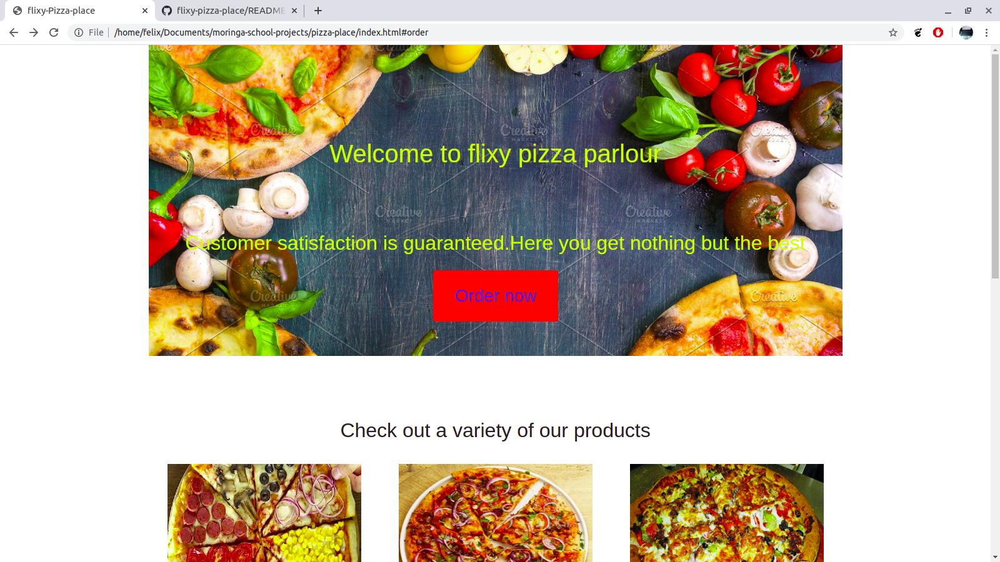

# flixy-pizza-parlour
## screenshot

## Author
[Felix-atika](https://github.com/Felixatika)
 ## Description
 This ias a web application for flixy-pizza-parlour.This application help connect a business with clients.
 Clients can be able to see the varieties of pizza available, order online depending on the size, crust and toppings
 they choose.It also allows the clients to enter their location for delivery.
 
 ## Live demo
 
 ## Installation instructions
 * Open Terminal {Ctrl+Alt+T}

* git clone ``

* cd flixy-pizza-parlour

* code . or atom . depending on the text editor of your choise.
 ## Technologies used
 [HTML]
 [Bootstrap]
 [Javascript]
 [Css[
 [jquery]
  
  ##Known bugs
  all toppings have the same price irregardless of the size of pizza ordered.
 
 ## Contact information
 Any contributions or question please reach out at [felixatika@gmail.com]
 
 ## License
 Licensed under [MIT License](LICENSE)
 
 copyright (c) 2020 **Felix atika**
